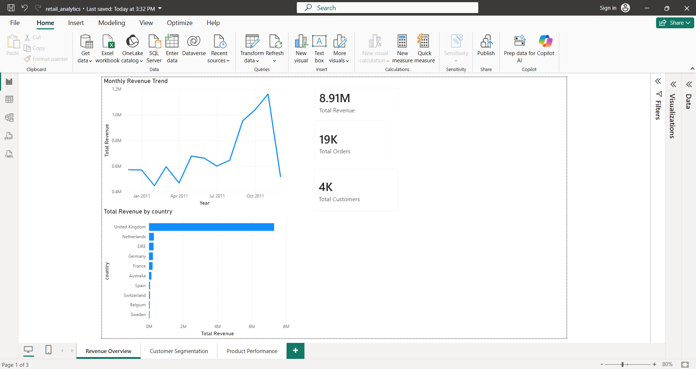
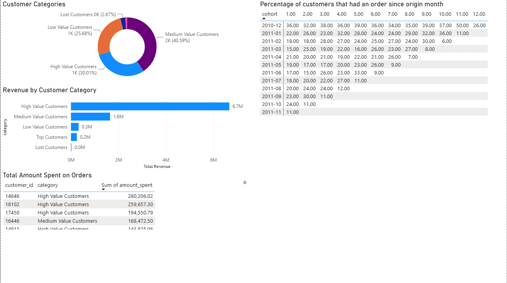
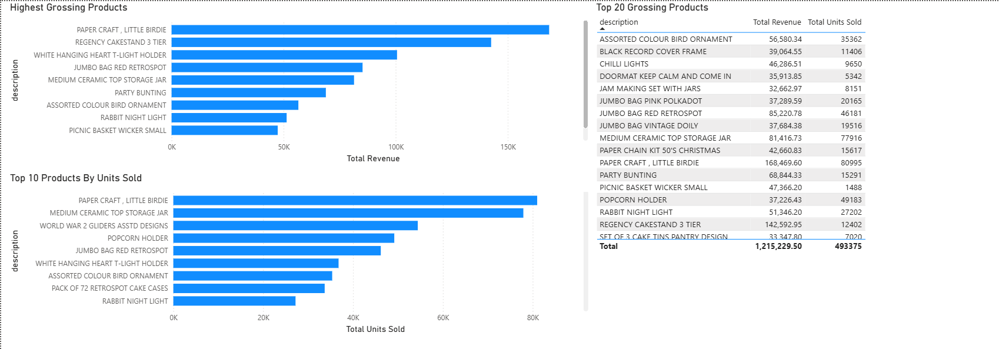

# UK Online Retail Customer Analytics
 
An end-to-end retail analytics pipeline built on the [UCI Online Retail Dataset](https://archive.ics.uci.edu/dataset/352/online+retail) (541,909 transactions). Raw transactional data is ingested into PostgreSQL, cleaned and normalised into a 3NF star schema, analysed using window functions and CTE-based SQL, and visualised in an interactive Power BI dashboard.
 
---
 
## Dashboard
 



 
---
 
## Project Structure
 
```
uk-retail-customer-analytics/
├── data/                        # Raw data (not tracked by git)
│   └── Online Retail.xlsx
├── src/
│   ├── python/
│   │   └── 01_load_data.py      # Bulk load raw Excel into PostgreSQL staging table via COPY
│   └── sql/
│       ├── 01_create_staging.sql  # Staging table definition (all TEXT, no constraints)
│       ├── 02_profile.sql         # Data quality profiling queries
│       ├── 03_clean_schema.sql    # Normalised schema (products, customers, invoices, invoice_lines)
│       ├── 04_migrate.sql         # ETL from staging into normalised schema
│       └── 05_analysis.sql        # RFM segmentation, cohort retention, revenue trends (views + queries)
├── dashboard/
│   ├── retail_analytics.pbix
│   └── screenshots/
│       ├── 01_revenue_overview.png
│       ├── 02_customer_segmentation.png
│       └── 03_product_performance.png
├── .env.example
├── .gitignore
├── requirements.txt
└── README.md
```
 
---
 
## Tech Stack
 
| Layer | Technology |
|---|---|
| Database | PostgreSQL 16 |
| Ingestion | Python (pandas, psycopg2) |
| Transformation | SQL (CTEs, window functions, views) |
| Visualisation | Power BI Desktop (live PostgreSQL connection) |
 
---
 
## Schema Design
 
The raw flat file was normalised to 3NF across four tables, eliminating partial and transitive functional dependencies identified during profiling.
 
**Functional dependencies identified:**
 
```
{stock_code}       → description
{customer_id}      → country
{invoice_no}       → invoice_date, customer_id
{invoice_no, stock_code} → quantity, unit_price
```
 
**Resulting schema:**
 
```
customers     (customer_id PK, country)
products      (stock_code PK, description)
invoices      (invoice_no PK, invoice_date, customer_id FK)
invoice_lines (line_id PK, invoice_no FK, stock_code FK, quantity, unit_price)
```
 
`invoice_lines` acts as the fact table. A surrogate key (`line_id SERIAL`) was used instead of a composite key because duplicate `(invoice_no, stock_code)` combinations exist in the source data — preserved as separate line items to maintain raw granularity.
 
**Migration results:**
 
| Table | Rows |
|---|---|
| customers | 4,339 |
| products | 4,059 |
| invoices | 18,536 |
| invoice_lines | 397,884 |
 
541,909 raw rows reduced to 397,884 invoice lines after excluding cancellations (invoice_no prefixed 'C'), null CustomerIDs, and non-positive quantities and prices.
 
---
 
## Data Quality Findings
 
Profiling was conducted in SQL against the staging table before any transformation:
 
| Issue | Count | Decision |
|---|---|---|
| Missing CustomerID | ~135,000 rows | Excluded from customer-level analysis |
| Cancellation records (invoice_no LIKE 'C%') | 9,251 | Isolated, excluded from clean schema |
| Negative quantity rows (returns) | ~10,000 | Excluded from clean schema |
| Non-positive unit prices | ~2,500 | Excluded from clean schema |
| 'Unspecified' country | 446 rows (2 customers) | Valid transactions, retained in aggregates, excluded from geographic analysis |
| Administrative stock codes (POSTAGE, Manual, DOTCOM POSTAGE) | — | Excluded from product analysis in Power BI via Power Query |
| Duplicate (invoice_no, stock_code) pairs | ~500 invoices | Retained with surrogate key — see schema design |
| Description inconsistency per stock_code | Multiple | Most frequent description per stock_code used during migration |
 
---
 
## Analysis
 
All analytical SQL lives in `05_analysis.sql`. The two complex queries are materialised as PostgreSQL views for Power BI consumption.
 
### RFM Segmentation (`rfm_segmented` view)
 
Customers scored 1–5 on Recency, Frequency, and Monetary value using `NTILE(5)` window functions. Scores averaged to produce a composite RFM total, then bucketed into five segments.
 
| Segment | Customers | Total Revenue | % of Revenue |
|---|---|---|---|
| High Value Customers | 1,302 (30.01%) | £6.7M | 75.2% |
| Medium Value Customers | 1,761 (40.59%) | £1.6M | 18.0% |
| Low Value Customers | 1,114 (25.68%) | £0.3M | 3.4% |
| Top Customers | 45 (1.04%) | £0.2M | 2.2% |
| Lost Customers | 116 (2.67%) | £0.0M | 0.5% |
 
**Key finding:** High Value customers represent 30% of the customer base but generate 75% of total revenue. Medium Value customers represent the largest segment (40%) but only 18% of revenue — the largest untapped upsell opportunity.
 
### Cohort Retention (`cohort_retention` view)
 
Customers grouped by acquisition month, tracked across 12 subsequent months to measure what percentage returned each month. Built using a multi-step CTE pipeline computing month differences via `EXTRACT`.
 
**Key finding:** The December 2010 cohort shows the strongest long-term retention, with ~36% returning in month 1 and maintaining double-digit retention through month 12 — consistent with a wholesale customer base making regular repeat orders.
 
### Revenue Trends
 
Monthly revenue computed using `DATE_TRUNC`, with running totals via `SUM() OVER (ROWS BETWEEN UNBOUNDED PRECEDING AND CURRENT ROW)` and month-over-month growth via `LAG()` with `NULLIF` to handle division by zero.
 
**Key finding:** Revenue peaked at £1.16M in November 2011, a 42% increase over October, consistent with pre-Christmas wholesale ordering. The sharp December 2011 drop reflects the dataset ending on 9 December rather than a genuine decline.
 
---
 
## Reproducing the Project
 
### Prerequisites
 
- PostgreSQL 16+
- Python 3.10+
- Power BI Desktop (Windows)
- npgsql driver (for Power BI PostgreSQL connector)
### 1. Clone the repository
 
```bash
git clone https://github.com/FranciszekMierzejewski/UCI-Online-Retail-Dataset.git
cd UCI-Online-Retail-Dataset
```
 
### 2. Install Python dependencies
 
```bash
pip install -r requirements.txt
```
 
### 3. Add the dataset
 
Download `Online Retail.xlsx` from the [UCI Machine Learning Repository](https://archive.ics.uci.edu/dataset/352/online+retail) and place it in the `data/` folder.
 
### 4. Configure environment variables
 
Copy `.env.example` to `.env` and set your PostgreSQL password:
 
```
DB_PASSWORD=your_password
```
 
### 5. Set up the database
 
```bash
psql -U postgres -c "CREATE DATABASE retail_db;"
psql -U postgres -d retail_db -f src/sql/01_create_staging.sql
```
 
### 6. Load the raw data
 
```bash
python src/python/01_load_data.py
```
 
### 7. Profile, migrate and analyse
 
```bash
psql -U postgres -d retail_db -f src/sql/02_profile.sql
psql -U postgres -d retail_db -f src/sql/03_clean_schema.sql
psql -U postgres -d retail_db -f src/sql/04_migrate.sql
psql -U postgres -d retail_db -f src/sql/05_analysis.sql
```
 
### 8. Open the dashboard
 
Open `dashboard/retail_analytics.pbix` in Power BI Desktop. If prompted, update the PostgreSQL connection to point to your local instance (`localhost`, database `retail_db`).
 
---
 
## Requirements
 
```
pandas>=2.0
openpyxl>=3.1
psycopg2-binary>=2.9
python-dotenv>=1.0
```
 
PostgreSQL 16+ and Power BI Desktop must be installed separately.
 
---
 
## Licence
 
MIT